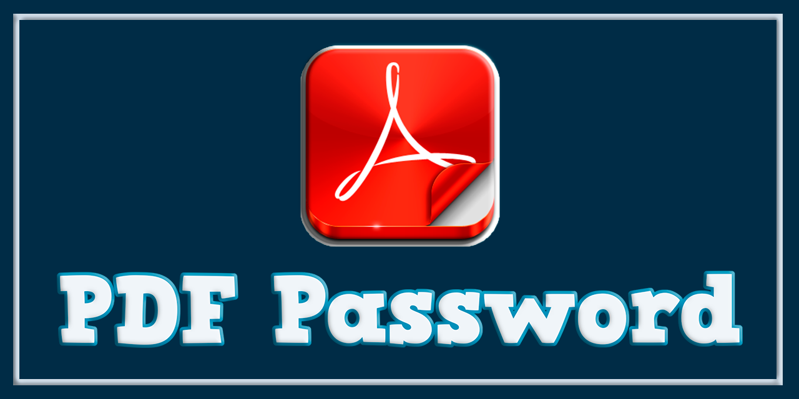

# 📄 PDF Password

PDF Password es un Gestor de PDF que funciona como una aplicación de escritorio desarrollada en **Python (Tkinter)** que permite **gestionar y proteger archivos PDF** mediante contraseña de forma simple, rápida y profesional.

El proyecto está pensado como una herramienta ligera y estable, enfocada en el usuario final, con especial cuidado en la compatibilidad DPI, el empaquetado en .exe y la eliminación de dependencias inestables para lograr una experiencia sólida en Windows.

---


---



---

## 🎯 Objetivo del proyecto

Este proyecto nace con el objetivo de ofrecer una alternativa simple, estable y confiable para la gestión de contraseñas en archivos PDF, evitando soluciones pesadas, dependencias inestables o interfaces confusas.

---

## ✨ Características principales

* ✨ Funcionalidad Drag & Drop para añadir archivos PDF fácilmente.
* 🔐 Protección de visualización y edición de PDFs con contraseña.
* 🔍 Detección inteligente del tipo de protección del PDF (visual/edición).
* 🔓 Descifrado inteligente de PDFs (elimina protección de edición sin contraseña, visual con contraseña).
* 🚫 Previene el cifrado de PDFs ya protegidos.
* 📂 Selección manual de archivos mediante botón Buscar PDF
* 🖼️ Interfaz escalada dinámicamente según DPI (monitores HiDPI / 4K)
* 🎨 Uso de imágenes HD escalables (logo, robot, botones)
* 🧠 Separación clara entre UI, configuración y utilidades
* 🪟 Ventana centrada y tamaño fijo
* 📄 Licencia MIT 
* 🌐 Internacionalización (i18n)
* 🔏 Protección de visualización y edición en PDFs
* 📦 Ejecutable .exe empaquetado y firmado
* 🚫 Eliminación de dependencias inestables en producción

---

## 🖼️ Interfaz

* Fondo con color primario configurable
* Logo y elementos gráficos con relieve visual
* ✨ Botones personalizados con imágenes y escalado dinámico.
* 💬 Cuadros de mensaje (pop-ups) modales con altura dinámica y botones personalizados.
* Campo para ruta del archivo PDF
* Campo para contraseña
* Botón de acción principal
* Escalado automático según resolución del sistema

---

## 🧱 Arquitectura del proyecto

```
PDF Password
│
├── app
│ ├── config.py # Configuración global (colores, tamaños, AppID)
│ ├── ui.py # Construcción de la interfaz principal
│ ├── ui_dnd.py # Drag & Drop (integrado con PyInstaller)
│ └── utils.py # Funciones auxiliares (centrado, helpers, gestión de imágenes DPI-aware)
│
├── images # Recursos gráficos (HD / escalables)
├── main.py # Punto de entrada de la aplicación
├── requirements.txt
└── main.spec # Configuración de PyInstaller
```

---

## 📷 Capturas de pantalla

<p align="center">
  
</p>

---

## 🧠 Detalles técnicos destacados

* ✔️ **DPI Awareness avanzado** para una interfaz nítida y escalada dinámicamente en monitores de alta resolución.
* ✔️ **Carga inteligente de imágenes** que se adaptan automáticamente al factor de escala del monitor, garantizando nitidez en cualquier pantalla.
* ✔️ **Funcionalidad Drag & Drop** completamente integrada y operativa, incluso en el ejecutable final compilado con PyInstaller.
* ✔️ **Inclusión y configuración de `tkinterdnd2`** en el ejecutable final para asegurar un Drag & Drop robusto.
* ✔️ .exe firmado digitalmente para mayor confianza en Windows

---

## 🚀 Ejecución

* Opción 1: Ejecutable (recomendado)

Puedes descargar la última versión estable directamente desde la sección Releases del repositorio oficial:

👉 Descargar desde GitHub Releases:
https://github.com/Pablitus666/PDF-Password/releases

Pasos:

* Descarga el archivo .zip desde Releases

* Extrae el contenido

* Ejecuta PDF Password.exe

* No requiere Python instalado ni dependencias externas

## Opción 2: Ejecución en desarrollo

* pip install -r requirements.txt

* python main.py

---

## 📦 Estado del proyecto

- ✔️ Estable 
- ✔️ Listo para uso real 
- ✔️ Enfoque profesional 
- ✔️ Compatible con Windows 10 / 11

---

## 🔮 Posibles mejoras futuras

* Soporte para múltiples PDFs
* Historial de archivos recientes
* Migración opcional a CustomTkinter

---

## 📄 Licencia

Este proyecto se distribuye bajo la licencia **MIT**.

---

## 🤝 Contribuciones

Las contribuciones, sugerencias y mejoras son bienvenidas.  
Si encuentras un problema o tienes una idea, no dudes en abrir un *issue* o *pull request*.

---

## 👨‍💻 Autor

Proyecto creado con enfoque en **calidad, estabilidad y buenas prácticas**.

*   **Nombre:** Pablo Téllez
*   **Contacto:** pharmakoz@gmail.com

---

⚖️ Nota legal

---

Este software está destinado al uso legítimo sobre archivos PDF de los cuales el usuario tenga autorización. El autor no se responsabiliza por el uso indebido de la herramienta.